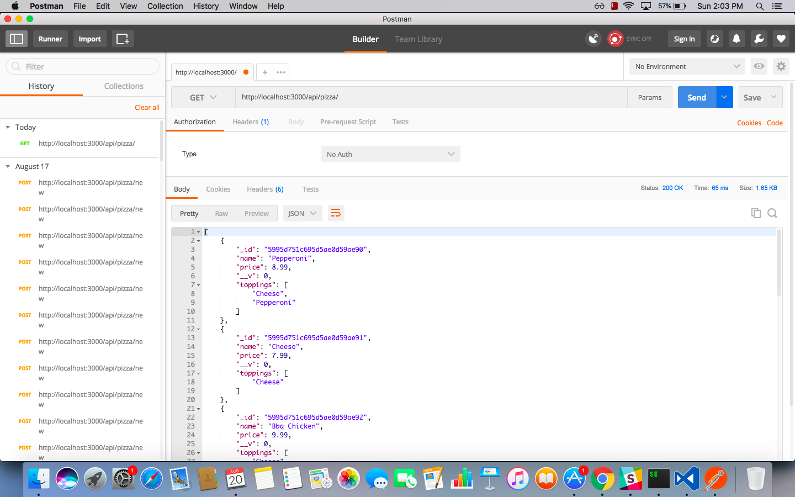
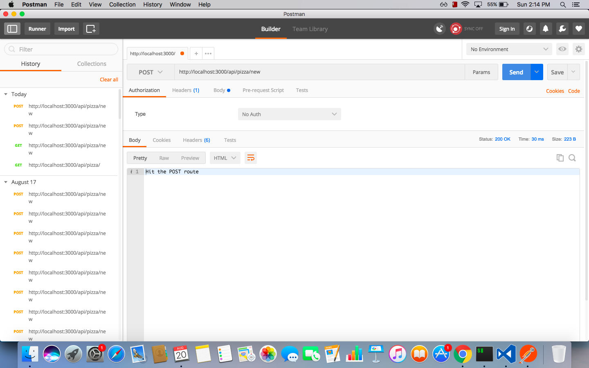
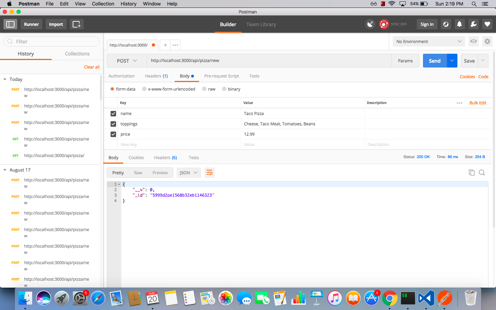

# teaching-postman

## Learning Objectives

- Learn how to use postman to show data from your api.
- You can also use postman to test your POST and PUT routes.

## What is Postman

Postman is the most complete toolchain for API development. The most-used REST client worldwide. Designed from the ground up to support the API developer. Intuitive user interface to send requests, save responses, add tests, and create workflows Read the docs.

### what does that mean?

It means that when we are building out our backend we can use Postman to test, and see that our server works before we put anything on our front end.  

It makes full-stack development simpler by removing opportunities for more things to go wrong.  Without postman you would have to build your api, and your api requests, and if either of those have an error you would have to fix that error before you could see if the api was giving you the data you want.  Postman allows you to test your expectations that much sooner.

## Code along

We will build a quick express server to show off how you can use postman to test your server. Lets start off by installing the necessary npm packages.

```
npm init -y
npm i -S express dotenv mongoose body-parser
touch server.js
```

### Create a quick little express server

Most of this is boiler plate now so we'll just copy this into our server.js

```
require("dotenv").config();
const express = require('express');
const bodyParser = require('body-parser');
const mongoose = require('mongoose');
const app = express();
mongoose.Promise = global.Promise;
mongoose.connect(process.env.MONGODB_URI); //mongodb://localhost/learning-postman

const connection = mongoose.connection;
connection.on('connected', () => {
  console.log('Mongoose Connected Successfully');    
}); 

// If the connection throws an error
connection.on('error', (err) => {  
  console.log('Mongoose default connection error: ' + err);
}); 

app.use(bodyParser.json());

app.get('/', (req,res) => {
  res.send('Hello world!')
})

const PORT = process.env.PORT || 3000;
app.listen(PORT, () => {
  console.log("Server is up on port: " + PORT);
})
```

Don't forget to make your .env file and add it to your gitignore.

```
MONGODB_URI = mongodb://localhost/learning-postman
```

### Create a schema, models, and seeds.

For this lesson we are going to be creating pizzas that we want to manipulate using postman so lets go ahead and make a Schema for our pizzas.

```
const mongoose = require('mongoose');

const PizzaSchema = mongoose.Schema({
    name: String,
    toppings: [Strings],
    price: Number
});

var PizzaModel = mongoose.model("Pizza", PizzaSchema);


module.exports = {Pizza: PizzaModel};
```

We will also need to make a model for it
```
var Schema = require('../db/schema');
var mongoose = require('mongoose');

var Pizza = Schema.Pizza;
module.exports = Pizza;
```

Lastly lets make some seeds for our database.
```
require("dotenv").config();
var mongoose = require('mongoose');
mongoose.connect(process.env.MONGODB_URI);

var Pizza = require('../models/pizza');

mongoose.Promise = global.Promise;

Pizza.remove({}, (err) => console.log(err));

const pizza1 = new Pizza({
    name: "Pepperoni",
    toppings: ["Cheese", "Pepperoni"],
    price: 8.99
});

const pizza2 = new Pizza({
    name: "Cheese",
    toppings: ["Cheese"],
    price: 7.99
})

const pizza3 = new Pizza({
    name: "Bbq Chicken",
    toppings: ["Cheese", "Bbq Sauce", "Chicken"],
    price: 9.99
})

const pizza4 = new Pizza({
    name: "Meat lovers",
    toppings: ["Cheese", "Sausage", "Pepperoni", "Ham", "Chicken"],
    price: 114.99,
})

const pizza5 = new Pizza({
    name: "Hawaiian",
    toppings: ["Cheese", "Ham", "Pineapple"],
    price: 9.99
})

pizza1.save();
pizza2.save();
pizza3.save();
pizza4.save();
pizza5.save();

mongoose.connection.close();
```

### Start a controller

Lets make a quick controller so that we can start using postman.

```
const express = require('express');
const Pizza = require('../models/pizza');
const router = express.Router()

//get route
router.get('/', (req, res) => {
  Pizza.find()
    .then((pizzas) => {
      res.json(pizzas)
    })
})
//post route

//put route

//delete route

module.exports = router
```

Don't forget to include the controller in your server.
```
const PizzaController = require('./controllers/pizza');
app.use('/api/pizza', PizzaController);
```

### Testing in Postman

Now that we have our first route setup let's go ahead and use postman to test out our route. If everything goes as planned we should see in postman that our server returns a list of all the pizzas.



That is excellent! We have built a route, and have shown it works in postman, and we haven't even done any client coding.

## Build a POST route to test

Now that we know our server is up and running, and we have a working GET route lets make a POST route and save some information to our database!

To do so we will build out a quit POST route that returns to us that we hit it.

```
router.post('/new', (req, res) => {
    res.send("Hit the POST route")
});
```

Now when we open Postman and test a post route we should get:



Knowing that we can successfully hit our POST route in postman let's now finish our route to save a new pizza.

```
router.post('/new', (req, res) => {
  const newPizza = new Pizza()
  newPizza.name = req.body.name;
  newPizza.toppings = req.body.toppings;
  newPizza.price = req.body.price;
  console.log(newPizza);
  newPizza.save()
  .then((newPizza)=> {
    res.json(newPizza)
  })
});
```

Hop over to Postman and lets send data to this route like we were handing over form data to our server.



Does that look right? The server sent back our new pizza object but it didn't save any of the form data! Do you know why this is?

It actually is because when we used body-parser in our server we also told it out method of communication was going to be JSON.
```
// remember this line?
app.use(bodyParser.json());
```
Axios calls send data in JSON as well, so when we sent over the form body, and it wasn't in JSON, body-parser didn't know how to read it.

Let's try again, but this time we will send raw JSON data over to our server.


Look at that! It works! If we go back to our GET route we can see that the pizza has been added to our database.

That is how you build out and test routes using Postman.

## You do: Build PUT and DELETE

Now that you've seen Postman in action you should be able to build your own routes for PUT and DELETE. You can grab object ids from the GET route to test in Postman.

Feel free to ask any questions!

